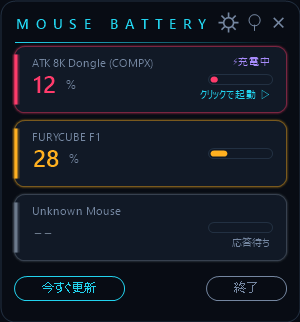
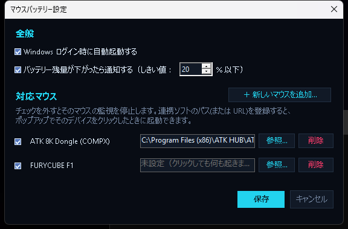

# Mouse Battery Tray

ワイヤレスマウスのバッテリー残量を、公式ソフトを使わずに Windows のタスクトレイに常時表示するツールです。

<p align="center">
  
  &nbsp;&nbsp;
  
</p>

## 特徴

- タスクトレイに残量%を表示（残量に応じて緑・黄・赤に色分け）
- クリックで開くポップアップに、接続中の各マウスの残量・電圧・充電状態・残り時間の目安を表示（残量が低い順に自動ソート）
- 📌 ピン留めでポップアップを常時表示にでき、ドラッグで好きな位置に固定可能
- マウスごとに監視のON/OFF、連携ソフト（公式アプリなど）へのリンクを設定可能
- バッテリー残量が指定%を下回ったら／満充電に近づいたら通知
- Windows ログイン時の自動起動、新バージョンの自動チェック
- 設定のエクスポート／インポート（他のPCへの移行用）
- 日本語 / English UI 切り替え対応
- **対応していないマウスも、公式ソフト等で確認した残量%を入力するだけで自動的にプロトコルを発見して追加できるウィザードを搭載**（AIやネットワーク通信は使わず、ローカルで完結）

## 対応デバイス

配布している exe には特定のマウスは一切プリセットされていません（`ProviderRegistry.BuiltIn` は空です）。起動後、設定画面の「＋ 新しいマウスを追加...」から自動発見ウィザードでご自身のマウスを追加してください。

以下のプロトコル方式は実機で動作確認済みで、同方式のマウスならウィザードで自動発見できます。

| 方式 | 内容 |
|---|---|
| COMPX方式ドングル | 17バイト入出力レポート・コマンド+チェックサム方式。多くの中華系8K/4Kポーリングのゲーミングマウスが該当 |
| パッシブプッシュ方式 | 受信機が数秒おきに固定長レポートを自発送信し、特定バイトにバッテリー%が入っている方式 |

さらに、設定画面の「テンプレートから追加...」から [`templates/devices.json`](templates/devices.json) の一覧を選ぶだけで追加できるマウスもあります（Logitech HID++ 2.0 / Razer）。これらは公開されているプロトコル仕様（Solaar・logitray・openrazerなど）を基に実装したものです。Logitech HID++ 2.0は実機で動作確認済みですが、Razer各機種は**まだ実機での検証が済んでいません**（一覧に「未検証」と表示されます）。テンプレートはこのリポジトリで管理しているので、実機で動作確認できた方はぜひ `templates/devices.json` へのPRをお願いします。

## 使い方

1. [Releases](../../releases) から `MouseBatteryTray.exe` をダウンロードして、好きな場所に置いて実行するだけです（.NET のインストールは不要です）。
2. タスクトレイのアイコンをクリックするとバッテリー残量パネルが開きます。
3. パネル右上のアイコン
   - ⚙ 設定を開く
   - 📌 ポップアップを常時表示に固定／解除
   - ✕ パネルを閉じる（アプリ自体は終了しません）
4. 設定画面でできること
   - マウスごとの監視ON/OFF・連携ソフトのパス（またはURL）登録
   - 対応していないマウスの追加（自動発見ウィザード、またはLogitech/Razerならテンプレートから）／不要なマウスの削除（非表示）
   - 自動起動・低残量通知のしきい値設定

タスクトレイに常時表示されない場合は、「隠れているインジケーターを表示する」(^) の中からアイコンをタスクバーへドラッグしてください（Windows標準の操作です）。

## 新しいマウスを追加する

設定画面の「＋ 新しいマウスを追加...」から:

1. 未対応の受信機を一覧から選択
2. 公式ソフトや本体表示で確認した現在のバッテリー%を入力
3. 「スキャン開始」でパッシブ受信を試行し、一致するバイトを自動探索
4. 見つからない場合は「アクティブ探索」（COMPX方式向けの安全な診断コマンドを1件だけ送信）を試行

これで見つからない場合はプロトコルが独自方式のため、`src/HidProbe` を使った手動解析が必要です（後述）。

## ビルド方法

.NET 8 SDK が必要です。

```bash
git clone https://github.com/flowercircle0304/mousebatteryUI.git
cd mousebatteryUI
dotnet build MouseBatteryTray.sln -c Release
```

単体の実行ファイル（.NET未インストール環境でも動く自己完結型 exe）を作る場合:

```bash
cd src/MouseBatteryTray
dotnet publish -c Release
# 出力先: bin/Release/net8.0-windows/win-x64/publish/MouseBatteryTray.exe
```

## プロジェクト構成

```
src/
  MouseBatteryTray/     本体（トレイアプリ）
    Providers/           マウスごとのバッテリー取得ロジック
    UI/                   ポップアップ・設定画面などのUI
  HidProbe/               新機種のHIDプロトコル調査用の診断ツール
```

新しいマウスの対応を自分でコードとして追加する場合は `src/MouseBatteryTray/Providers/ProviderRegistry.cs` のコメントを参照してください。多くの中華系8K/4Kドングルは `CompxDongleProvider` に型番を1行追加するだけで対応できます。

## 動作環境

- Windows 10 / 11
- USB無線レシーバー方式のマウス（Bluetooth接続のマウスは非対応）
